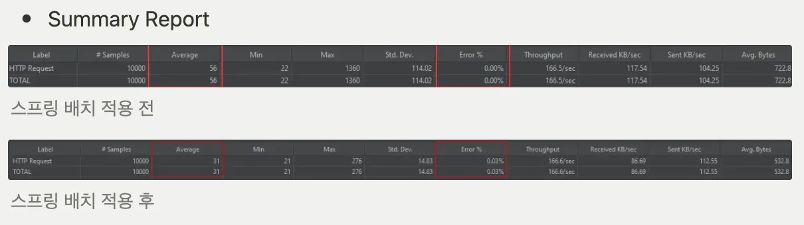
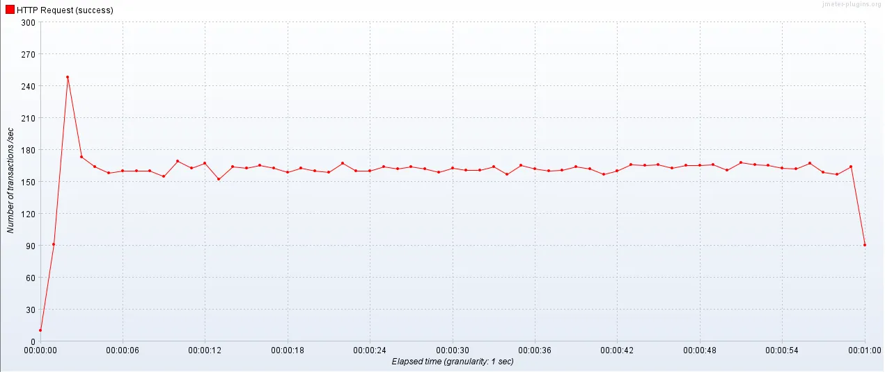
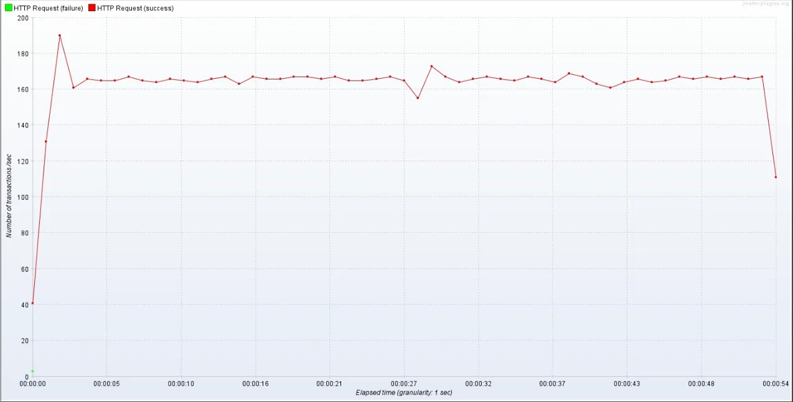
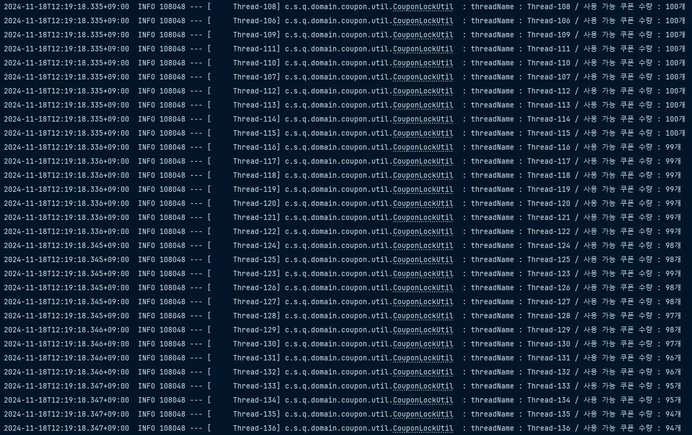
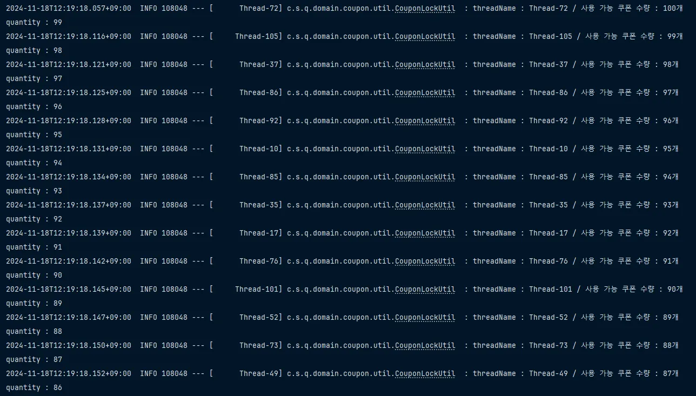
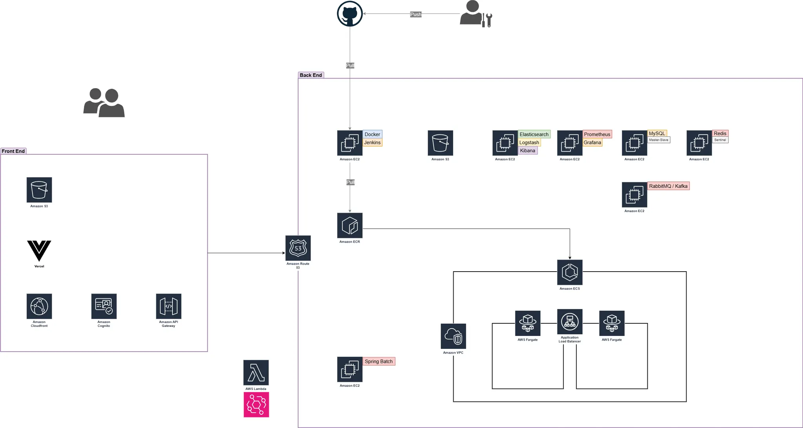
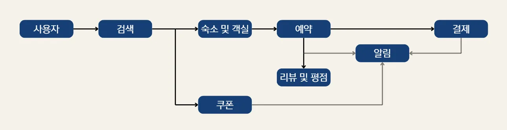
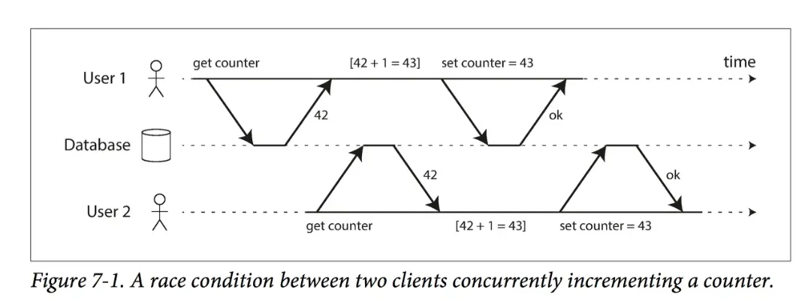

<div align="center">

# 🟦🟧 QUOKKA TRAVEL 🟧🟦


</div>

사용자 중심의 여행 예약 플랫폼을 구축하여 사용자가 필요한 전국의 숙소를 실시간으로 예약 가능하고 사용후 리뷰를 남길 수 있는 서비스를 제공하는 야놀자, 에어비앤비를 벤치마킹한 여행 플랫폼 서비스입니다.


<br>
<br>

<div align="center">

# 🟦🟧 프로젝트 핵심 목표 🟧🟦

</div>

### [성능 최적화]
- Redis 기반 캐싱 도입으로 월별 통계 조회 성능을 데이터베이스 10,000개 기준 40배(97.5%) 향상
- Redisson을 활용하여 CPU 점유율 47.6% 감소 및 안정적인 데이터 처리 구현

### [대용량 데이터 처리]
- 대량의 쿠폰 발급과 많은 이용자의 휴면 계정 처리에 대한 스프링 배치 적용을 통해 평균 응답 시간과 응답 지연(최소/최대 시간)을 줄이고 처리 속도 향상
- 배치 처리 적용 후 일괄 처리 방식이 최적화되어 평균응답 시간 44.64% 감소

<div align="center">

<br>
<br>

# 🟦🟧 KEY SUMMARY 🟧🟦

</div>

### 💡 스프링 배치 적용
<br>
<details>
<summary> 쿠폰 발급 </summary> 
  <br>

### **1. 문제 정의**

쿠폰 발급 기능은 대량의 사용자 요청을 처리해야 하며, 특정 시간대에 트래픽이 집중되면서 성능 문제가 발생. 기존 시스템은 쿠폰 발급 시 **개별 요청 처리 방식**을 사용했으며, 이는 다음과 같은 문제를 초래

- **높은 서버 부하**: 동시 요청 증가 시 응답 시간이 급격히 늘어남
- **비효율적인 자원 사용**: 개별 처리로 인해 데이터베이스 연결과 트랜잭션 수 증가
- **사용자 경험 악화**: 응답 지연 및 요청 실패 빈도 증가

### **2. 개선 목표**

- 평균 응답 시간과 응답 지연(최소/최대 시간)을 줄이고, 처리 속도를 향상
- 시스템의 처리량(시간당 요청 처리 수)과 데이터 처리 효율성을 높임
- 안정적이고 확장 가능한 구조를 설계하여 성능을 보장

### **3. 의사결정 과정**

스프링 배치를 선택한 이유

- **대량 데이터 처리에 적합**: 스프링 배치는 대량 데이터 처리에 최적화된 프레임워크로, 안정성과 확장성을 보장
- **Chunk 기반 트랜잭션 지원**: 대량 데이터를 효율적으로 처리하며, 장애 발생 시 특정 지점에서 작업 재개 가능
- **Spring Ecosystem 통합성**: 기존 시스템(Spring 기반)과 쉽게 통합 가능하며, 추가 라이브러리 의존성이 적음
- **유지보수 용이성**: 선언적 구성이 가능하고, 스케줄링과 통합되어 향후 유지보수에 유리

### **4. 개선 방법**

기존의 **개별 처리 방식**에서 **스프링 배치(Spring Batch)**를 활용한 **일괄 처리 방식**으로 전환

구체적인 개선 방법

- 대량의 쿠폰 발급 요청을 하나의 배치 작업으로 묶어 처리
- `ItemReader`, `ItemProcessor`, `ItemWriter`를 활용해 데이터 읽기, 처리, 저장을 단계별로 최적화

### **5. 개선 전/후 비교**
- Summary Report


<br>

- TPS


<br>

- 스프링 배치 적용 전


<br>

- 스프링 배치 적용 후

 Number of Threads (users) : 10000

 Ramp-up period (seconds) : 60

 Loop Count : 1

</details>
<br>

### 💡 ElasticSearch 검색 문제
<br>
<details>
<summary> ElasticSearch </summary> 
  <br>

### 1. 문제 정의

기존 Elasticsearch를 이용한 검색에 여러가지 문제점들이 발견

1. 정확도를 높이기 위해서 너무 많은 토큰이 생성되어서 오히려 속도가 많이 감소
2. 전문 검색에 대한 고려를 하지 않아서 전문 검색 시 일부만 일치하더라도 검색이 되는 문제가 발생

### 2. 해결 방안
기존 설정
<br>
- 기존 Index 설정값
```
{
  "settings": {
    "analysis": {
      "analyzer": {
        "my_analyzer": {
          "type": "custom",
          "tokenizer": "my_nori_tokenizer",
          "filter": ["nori_posfilter"]
        },
        "mixed_korean_english_analyzer": {
          "type": "custom",
          "tokenizer": "standard",
          "filter": ["lowercase"]
        },
        "nori_analyzer": {
          "type": "custom",
          "tokenizer": "nori_tokenizer",
          "filter": ["lowercase"]
        },
        "english_ngram_analyzer": {
          "type": "custom",
          "tokenizer": "standard",
          "filter": ["lowercase", "edge_ngram_filter"]
        }
      },
      "tokenizer": {
        "my_nori_tokenizer": {
          "type": "nori_tokenizer",
          "decompound_mode": "mixed"
        }
      },
      "filter": {
        "edge_ngram_filter": {
          "type": "edge_ngram",
          "min_gram": 2,
          "max_gram": 10
        },
        "nori_posfilter": {
          "type": "nori_part_of_speech",
          "stoptags": [
            "E", "IC", "J", "MAG", "MAJ", "MM", "NA", "NR",
            "SC", "SE", "SF", "SH", "SL", "SN", "SP",
            "SSC", "SSO", "SY", "UNA", "UNKNOWN",
            "VA", "VCN", "VCP", "VSV", "VV", "VX",
            "XPN", "XR", "XSA", "XSN", "XSV"
          ]
        }
      }
    }
  },
  "mappings": {
    "properties": {
      "id": {
        "type": "text"
      },
      "accommodationId": {
        "type": "long"
      },
      "name": {
        "type": "text",
        "analyzer": "mixed_korean_english_analyzer",
        "fields": {
          "english_field": {
            "type": "text",
            "analyzer": "english_ngram_analyzer"
          },
          "korean_field": {
            "type": "text",
            "analyzer": "my_analyzer"
          }
        }
      },
      "koreanPartOfName": {
        "type": "text",
        "analyzer": "my_analyzer"
      },
      "englishPartOfName": {
        "type": "text",
        "analyzer": "english_ngram_analyzer"
      },
      "address": {
        "type": "text",
        "analyzer": "nori_analyzer"
      },
      "rating": {
        "type": "long"
      },
      "imageurl": {
        "type": "text"
      }
    }
  }
}
```
<br>

- 기존 검색 메서드
```
public List<AccommodationDocument> searchAccommodations(String name, String address, Long rating) throws IOException {

        List<Query> mustQuery = new ArrayList<>();

        if (name != null && !name.isEmpty()) {
            MultiMatchQuery multiMatchQuery = new MultiMatchQuery.Builder()
                    .query(name)
                    .fields("name","korean_part_of_name",  "english_part_of_name")
                    .build();
            mustQuery.add(new Query.Builder()
                    .multiMatch(multiMatchQuery)
                    .build());
        }
        if (address != null && !address.isEmpty()) {
            MatchQuery matchQuery = new MatchQuery.Builder()
                    .field("address")
                    .query(address)
                    .build();
            mustQuery.add(new Query.Builder()
                    .match(matchQuery)
                    .build());
        }
        if (rating != null) {
            MatchQuery matchQuery = new MatchQuery.Builder()
                    .field("rating")
                    .query(rating)
                    .build();
            mustQuery.add(new Query.Builder()
                    .match(matchQuery)
                    .build());
        }

        BoolQuery boolQuery = new BoolQuery.Builder()
                .must(mustQuery).build();

        SearchRequest searchRequest = new SearchRequest.Builder()
                .index("accommodations")
                .query(new Query.Builder().bool(boolQuery).build()).build();

        SearchResponse<AccommodationDocument> response = elasticsearchClient.search(searchRequest, AccommodationDocument.class);

        List<AccommodationDocument> documentList = new ArrayList<>();

        for (Hit<AccommodationDocument> hit : response.hits().hits()) {
            documentList.add(hit.source());
        }

        return documentList;

    }
```
<br>

- 수정된 Index 설정값
```
{
  "settings": {
    "index": {
      "requests.cache.enable": true
    },
    "analysis": {
      "analyzer": {
        "korean_analyzer": {
          "type": "custom",
          "tokenizer": "nori_tokenizer",
          "filter": ["lowercase", "nori_posfilter"]
        },
        "english_analyzer": {
          "type": "custom",
          "tokenizer": "standard",
          "filter": ["lowercase", "edge_ngram_filter"]
        }
      },
      "filter": {
        "edge_ngram_filter": {
          "type": "edge_ngram",
          "min_gram": 2,
          "max_gram": 7
        },
        "nori_posfilter": {
          "type": "nori_part_of_speech",
          "stoptags": ["E", "IC", "J", "MAG", "MM", "UNA"]
        }
      }
    }
  },
  "mappings": {
    "properties": {
      "accommodationId": {
        "type": "long"
      },
      "name": {
        "type": "text",
        "fields": {
	        "raw": {
            "type": "keyword"
          },
          "korean": {
            "type": "text",
            "analyzer": "korean_analyzer"
          },
          "english": {
            "type": "text",
            "analyzer": "english_analyzer"
          }
        }
      },
      "address": {
        "type": "text",
        "analyzer": "standard"
      },
      "rating": {
        "type": "long"
      },
      "imageurl": {
        "type": "keyword",
        "ignore_above": 512
      }
    }
  }
}
```
기존의 것에서 중복되는 부분을 삭제하고, 서브 필드만 남기는 방향으로 설정

그리고 전문 검색을 고려하여 `name`의 타입을 `keyword`로 설정

<br>
또한 전문 검색을 문제를 해결하기 위해서 Service 부분의 메서드도 수정

- 수정된 검색 메서드
```
public List<AccommodationDocument> searchAccommodations(String name, String address, Long rating) throws IOException {

        List<Query> mustQuery = new ArrayList<>();

        if (name != null && !name.isEmpty()) {
            BoolQuery.Builder nameQueryBuilder = new BoolQuery.Builder();
            Query extractMatchQuery = new Query.Builder()
                    .term(t -> t.field("name").value(name))
                    .build();
            nameQueryBuilder.should(extractMatchQuery);

            Query multiMatchQuery = new Query.Builder()
                    .multiMatch(m -> m
                    .query(name)
                    .fields(List.of("name.korean",  "name.english"))
                    .minimumShouldMatch("75%")
                    ).build();
            nameQueryBuilder.should(multiMatchQuery);

            mustQuery.add(new Query.Builder()
                    .bool(nameQueryBuilder.build())
                    .build());
        }
        if (address != null && !address.isEmpty()) {
            MatchQuery matchQuery = new MatchQuery.Builder()
                    .field("address")
                    .query(address)
                    .build();
            mustQuery.add(new Query.Builder()
                    .match(matchQuery)
                    .build());
        }
        if (rating != null) {
            MatchQuery matchQuery = new MatchQuery.Builder()
                    .field("rating")
                    .query(rating)
                    .build();
            mustQuery.add(new Query.Builder()
                    .match(matchQuery)
                    .build());
        }

        BoolQuery boolQuery = new BoolQuery.Builder()
                .must(mustQuery).build();

        SearchRequest searchRequest = new SearchRequest.Builder()
                .index("test_index03_for_accommodations")
                .query(new Query.Builder().bool(boolQuery).build()).build();

        SearchResponse<AccommodationDocument> response = elasticsearchClient.search(searchRequest, AccommodationDocument.class);

        List<AccommodationDocument> documentList = new ArrayList<>();

        for (Hit<AccommodationDocument> hit : response.hits().hits()) {
            documentList.add(hit.source());
        }

        return documentList;

    }
```
기존에 `multimatchquery`부분에 대해서 정확한 매칭을 위해서 `extractMatchQuery`를 추가

그리고 `multiMatchQuery`에 대해서는 `minimumShouldMatch`을 통해서 검색어의 일치율을 조정

</details>

<br>
<br>

<div align="center">

# 🟦🟧 트러블 슈팅 🟧🟦

</div>
<br>
<details>
<summary> [1] 인증 인가 </summary>

### **1. 문제 발생**

각 api에 관해서 다양한 인가가 요구되는 상황이 발생

예를 들어 특정 숙소의 수정을 보면 사용자가 HOST권한을 갖고 있어야 하고, 채팅방의 경우에 OWNER만 다른 유저를 퇴장 시킬 수 있어야 하는 상황

### **2. 문제 원인 분석**

원인은 아니지만 일단 분석을 통해 다양한 인가들이 요구되는 중이기에 최대한 범용적으로 사용하고 수정이 쉬운 방향으로 해당 인가를 처리 시도

### **3. 문제 해결 방안**

일단 인가를 해결하기 위한 방법은 생각이 났지만 더 좋은 방법이 있는지 확인한 결과 대략적으로 4가지로 추림

1. Spring Security의 `@PerAuthorize`, `@Secured` 어노테이션

   해당 방식은 Spring Security가 제공하는 권한 인가 어노테이션을 활용하여, 메서드 실행 전에 권한을 체크하는 방법
```
// PreAuthorize
@PreAuthorize("hasRole('ROLE_GUEST')")
public AccommodationResponseDto viewAccommodation(Long accommodationId) {
    return new AccommodationResponseDto(
        accommodationRepository.findById(accommodationId)
            .orElseThrow(() -> new AccommodationNotFoundException(accommodationId))
    );
}

// Secured
@Secured("ROLE_ADMIN")
    public void adminTask() {
        System.out.println("Admin task executed");
    }
```
- 장점 : 간결하고, 범용성과 확장성이 뛰어남
- 단점 : 복잡한 로직에서는 조금 제한적이 될 수 있음
2. Spring Security Filter

```
http
    .authorizeRequests()
    .antMatchers("/admin/**").hasRole("ADMIN")
    .antMatchers("/host/**").hasRole("HOST")
    .antMatchers("/guest/**").hasRole("GUEST")
    .anyRequest().authenticated();
```
- 장점 : URL 별로 인가가 가능하며, Filter만 수정하면 되므로 나름 간결
- 단점 : 메서드 레벨로 인가는 불가능하고, 세세하게 인가를 하면 복잡해질 수 있음
3. HandlerInterceptor

   Spring의 `HandlerInterceptor`를 사용하여 HTTP 요청의 전/후에 Role을 체크하는 방법
```
@Component
public class RoleInterceptor implements HandlerInterceptor {
		...
		
		 String requestURI = request.getRequestURI();
        if (requestURI.startsWith("/admin") && !userDetails.hasRole("ROLE_ADMIN")) {
            response.sendError(HttpServletResponse.SC_FORBIDDEN, "Access Denied");
            return false;
        }
        if (requestURI.startsWith("/host") && !userDetails.hasRole("ROLE_HOST")) {
            response.sendError(HttpServletResponse.SC_FORBIDDEN, "Access Denied");
            return false;
        }
				
		...
}
```
- 장점 : 특정 URL 패턴에 대해 사용자 권한 제어를 하며 나름 범용성도 있음
- 단점: 매우 복잡하고 메서드 레벨 인가는 어려움
4. AOP

   AOP를 사용하여 메서드 실행 전에 권한을 동적으로 체크할 수 있음

   Role에 따른 권한 로직을 중앙에서 관리할 수 있고, 공통적인 권한 로직을 적용하기 좋음
```
@Aspect
@Component
public class RoleAuthorizationAspect {

    @Before("@annotation(roleCheck)")
    public void checkRoleAuthorization(JoinPoint joinPoint, RoleCheck roleCheck) {
        // SecurityContext에서 현재 사용자 정보를 가져옴
        CustomUserDetails userDetails = (CustomUserDetails) SecurityContextHolder.getContext().getAuthentication().getPrincipal();
        
        String requiredRole = roleCheck.value(); // @RoleCheck에서 지정한 권한

        // 사용자의 권한을 확인하고 예외 처리
        if (!userDetails.getAuthorities().contains(new SimpleGrantedAuthority("ROLE_" + requiredRole.toUpperCase()))) {
            throw new AccessDeniedException("User does not have the necessary role: " + requiredRole);
        }
    }
}
```
### **4. 문제 해결**

이러한 방법을 고민한 결과 채택한 방식은 spring security의 **`@PreAuthorize` ,`@Secured`** 방식

가장 범용적으로 사용될 수 있는 방식이라 생각하고, User Role뿐만 아니라 다양한 표현식을 적용할 수 있어 Entity-specific Role 체크에도 적합

또한 설정이 간단하고, 복잡한 인가 로직을 처리할 때는 SpEL을 사용하여 확장할 수 있음

위와 같은 이유로 해당 방식

⇒ spring security의 **`@PreAuthorize` ,`@Secured`** 방식

을 채택

</details>

<br>

<details>
<summary> [2] CI/CD </summary>

### **1. 문제 발생**

CI/CD 핵심 기능 개발 중, Docker 내부의 Jenkins 컨테이너에서 추가 Docker 환경이 필요해지는 상황이 발생. Jenkins 파이프라인 실행 중 **docker: not found** 오류가 발생하며 설정이 중단되는 문제가 발생

### **2. 문제 원인 분석**

Jenkins 파이프라인을 실행하면서 **docker: not found**라는 로그가 확인되었고, Jenkins 컨테이너가 Docker 명령을 사용할 수 없는 상태임을 알게 됨. 이는 **Docker in Docker (DinD)** 구조가 필요함을 나타냈음. Docker 컨테이너 내부에서 Docker를 사용하는 방법에는 크게 두 가지가 있음

1. **Docker 데몬을 마운트하여 사용하는 방식** (Docker Outside of Docker, DooD)
2. **컨테이너 내부에 Docker를 설치**하여 독립적으로 사용하는 방식 (DinD)

### **3. 의사결정 과정**

두 가지 방식 중 최종적으로 **DinD (Docker in Docker)** 방식을 선택. 이 방법은 컨테이너 내부에 Docker를 실제로 설치하여 독립적인 Docker 환경을 사용할 수 있도록 하는 것.

선택한 이유
- **독립성**: 컨테이너 내부에서 독립적인 Docker 환경을 제공하여 호스트와의 의존성을 줄일 수 있음
- **유연성**: 독립적인 Docker 환경을 통해 CI/CD 파이프라인 설정의 확장성을 높일 수 있음

### **4. 개선 방법**

DinD 방식을 적용하여 Jenkins 컨테이너 내에 Docker를 설치하는 설정을 진행. 이를 통해 Jenkins 컨테이너 내에서 독립적으로 Docker를 사용할 수 있게 되었고, 별도의 호스트 Docker 마운트가 필요하지 않음.
```
-v /var/run/docker.sock:/var/run/docker.sock
```
```
# DinD를 위한 Jenkins 컨테이너 실행 설정
docker run -d -p 8080:8080 -p 50000:50000 \
--name jenkins \
--privileged \
jenkins/jenkins:lts-jdk17
```
이 설정을 통해 Jenkins 컨테이너가 독립적인 Docker 환경을 가지게 되었고, 호스트 Docker에 의존하지 않고 Docker 명령어를 실행할 수 있게 되었음

### **5. 문제 해결 및 효과**

1. **Before & After 캡처**:
   - **Before**: 오류 로그 - **docker: not found**
   - **After**: 정상 작동 캡처 - Docker 명령어가 정상적으로 실행됨을 확인
2. **개선된 효과**:
   - Docker 명령어 사용이 정상화되어 CI/CD 파이프라인이 중단 없이 원활하게 실행될 수 있게 되었습니다.
   - **독립적 환경 유지**: 호스트와 독립적인 Docker 환경을 유지하여 파이프라인 설정과 운영이 유연해짐
3. **추가적 이점**:
   - **유연성 증대**: Jenkins 컨테이너에서 호스트에 의존하지 않는 독립적인 Docker 환경을 사용함으로써 배포 및 운영 환경의 유연성을 확보했음
   - **효율성 유지**: 독립적 Docker 환경을 통해 안정성을 확보하면서도, 컨테이너 내부에서 필요한 기능을 충분히 활용할 수 있음
</details>

<br>

<details>
<summary> [3] 분산락 적용 </summary>

기능 : 쿠폰 등록

### **1. 문제 발생 및 원인 분석**

쿠폰을 등록하는 과정에서 Race Condition 으로 인한 오류가 발생

여러 사용자가 동시에 쿠폰을 신청했을 때, 각각의 요청은 데이터베이스에 접근하여 현재 쿠폰 수를 가져온 뒤 각각의 쿠폰에 대해 남은 쿠폰 수를 하나씩 줄이는 트랜잭션을 거치게 됨. 이 때, Race Condition 이 발생하게 되면, 결과적으로 여러명이 쿠폰을 등록했음에도 불구하고

1. 쿠폰 수가 하나씩만 감소한다거나
2. 순차적으로는 A가 먼저 쿠폰을 등록을 했지만 A는 쿠폰을 등록하지 못하고, 나중에 등록한 B 는 쿠폰 등록에 성공하는 문제

등이 발생할 수 있음

### **2. 기술 결정 및 문제 해결**

이를 해결하기 위해 분산락을 사용하였고, Redisson 을 통해 중간 브로커 역할을 하는 단일 스레드 환경의 서버를 만들어 줌으로써 동시성 문제를 해결

아래는 동시성 제어를 고려해 분산락을 사용한 메서드의 테스트 결과



</details>

<div align="center">

# 🟦🟧 인프라 아키텍처 & 적용 기술 🟧🟦

</div>

### 아키텍처 다이어그램 



<br>
<br>

<div align="center">

# 🟦🟧 주요 기능 🟧🟦

</div>

<br>


- 검색 : 숙소 및 객실 검색
- 예약 : 원하는 숙소에서 예약하고 싶은 객실을 골라서 예약
- 결제 : 예약을 위한 결제 시스템
- 쿠폰 : 행사
- 리뷰 및 평점 : 사용한 숙소에 대하여 리뷰및 평점을 남김
- 알림 : 예약 성공과 쿠폰 발급에 대한 알림

<details>
  <summary> [1] 모니터링 </summary>

- Prometheus를 사용하여 애플리케이션의 메트릭 데이터를 수집 → Grafana에서 시각화하여 시스템 상태와 성능을 모니터링 
- 만약 CPU 사용량이 80%를 초과하는 상황이 발생하면 Slack을 통해 알림을 전송
- Jmeter 과부하 테스트를 통해 성능 최적화
</details>

<br>

<details>
  <summary> [2] 스프링 배치 </summary>

**1.쿠폰 발급 기능**

- **설명**: 특정 조건을 만족하는 사용자에게 쿠폰을 자동으로 발급하는 배치 작업을 구성
- **프로세스**:
   - **Step 1**: 쿠폰 발급 대상 사용자 조회
   - **Step 2**: 조회된 사용자에게 쿠폰 생성 및 발급
   - **Step 3**: 발급된 쿠폰 정보를 저장하고, 알림을 통해 사용자에게 전달
- **주요 이점**: 이벤트성 쿠폰 발행을 자동화하여 관리자 업무를 효율화하고, 사용자에게 혜택을 신속히 제공

**2. 휴면 계정 처리 기능**

- **설명**: 장기간 비활성화된 계정을 휴면 처리하는 배치 작업을 통해 계정 관리를 최적화
- **프로세스**:
   - **Step 1**: 일정 기간 동안 로그인하지 않은 비활성 계정 조회
   - **Step 2**: 조회된 계정을 대상으로 휴면 처리 상태로 업데이트
   - **Step 3**: 휴면 처리된 계정에 대해 알림 전송 및 보안 관리 강화
- **주요 이점**: 비활성 계정을 효율적으로 관리하고, 시스템 보안을 강화하여 계정 정보를 보호
</details>

<br>

<details>
  <summary> [3] CI/CD </summary>

[Jenkins, Docker, AWS ECR/ECS를 이용한 CI/CD 파이프라인 구축]

- CI/CD 파이프라인 설계 및 구현
   - Jenkins 파이프라인을 설계하여 깃허브에 코드가 푸시될 때 자동으로 빌드가 트리거되도록 설정
- Docker 이미지 빌드 및 ECR 푸시
   - Docker를 활용하여 애플리케이션을 컨테이너화하고, Jenkins 파이프라인에서 Docker 이미지를 빌드 후 AWS ECR에 자동 푸시하도록 구성
- AWS ECS 자동 배포화
   - AWS ECR에 저장된 이미지를 ECS 클러스터에 자동 배포하도록 설정하여, 코드 변경 사항이 즉시 ECS에 반영
</details>

<br>

<details>
  <summary> [4] Caching </summary>

**Redis를 활용한 Caching 처리**

1. Accommodation 조회
2. Room 조회
3. MonthOfStatistics 조회

Cache의 적용은 캐시 읽기 전략의 Cache-Aside 패턴을 바탕으로 진행

데이터를 찾을 때 캐시에 저장된 데이터가 있는지 우선적으로 확인하는 전략으로, 캐시에 데이터가 없으면 DB에서 조회를 진행함

반복적인 읽기가 많은 부분에 적합하기에 위 조건들에 적용

**캐시 데이터 일관성 유지**

캐시 데이터의 일관성을 유지하기 위해서 AOP를 활용해 해당 캐시 데이터의 원본이 되는 데이터에 수정 및 삭제가 이루어지게 되면 잔여 캐시를 삭제하도록 설정
</details>

<br>

<details>
  <summary> [5] Indexing </summary>

조회 성능 최적화를 위한 Indexing 적용

일반적으로 많이 사용되는 User_Email, Accomodation_Id, Coupon_Code 등의 Column에 대해서 인덱스를 매겨 각 메서드들의 처리 속도를 향상시킴

</details>

<br>

<details>
  <summary> [6] DB 이중화 </summary>

데이터베이스의 성능과 안정성을 높이기 위하여 DB 이중화 전략을 채택

선택한 방법으로는 Master-Slave Replication 방법을 사용

1. 성능
   1. 읽기 부하 분산 - Slave 측이 READ 작업을 처리하도록 분산 → Master 측의 부하 감소
2. 안정성
   1. 실시간 복제 - Master의 데이터를 Slave에 자동으로 동기화 → 데이터 유실 가능성 감소
   2. 백업 용이성 - Slave 서버를 이용한 백업 진행 → Master 성능에 영향 없이 안정적인 백업 가능
   3. 장애 대응 - Master에 문제가 발생해도 Slave를 빠르게 승격시켜 다운타임 최소화 가능
3. 확장성
   1. 현재는 반영하지 않았지만, 추후 Slave를 쉽게 추가하여 수평 확장이 가능

추후 고려사항

1. 복제 지연 문제: 만약 Master, Slave 간 데이터 동기화에 지연이 발생할 경우
2. Failover 자동화: 자동 장애조치를 위해서 별도의 관리 툴을 사용하는 것이 좋아보임

</details>

<br>

<details>
  <summary> [7] Elastic Search </summary>

Elasticsearch를 활용하여 숙소 및 쿠폰 검색 기능 구현

1. 숙소 검색

   숙소의 경우, 이름, 주소, 평점으로 검색이 가능하도록 구현

2. 쿠폰 검색(ADMIN 전용)

   쿠폰의 경우, 이름과 쿠폰 타입(숙소에 적용되는 쿠폰인지, 이벤트에 적용되는 쿠폰인지), 그리고 쿠폰의 상태를 가지고 검색이 가능하도록 구현


</details>

<br>

<details>
  <summary> [8] Notification </summary>

1. Redis Pub/Sub을 통한 Slack 알림 기능 구현
   - Redis Pub/Sub 알림 시스템
      - Redis의 Pub/Sub 기능을 활용하여 어드민이 쿠폰 발급 시 자동으로 전체 알림 메세지를 슬랙으로 전송하도록 설계
      - 이벤트가 발생하면 Redis에서 메세지를 발행하고, 슬랙 알림 모듈이 이를 구독하여 메세지를 받아 처리
   - Slack API 연동
      - 구독한 메세지를 Slack API와 연동하여 슬랙 채널에 알림이 전송되도록 구현, 이를 통해 실시간으로 시스템 이벤트(쿠폰)에 대한 슬랙 전체 알림을 받을 수 있도록 구성
2. Spring Boot 이메일 서비스로 예약 및 쿠폰 알림 구현
   - 이메일 알림 서비스 설계
      - 예약 생성, 수정, 취소 및 쿠폰 등록, 취소 시 자동으로 이메일 알림이 발송되도록 구현
      - 이메일 발송에는 @Async 애너테이션을 적용하여 비동기적으로 처리하도록 설정, 이를 통해 이메일 발송이 메인 서비스 흐름을 발행하지 않고 성능과 응답 속도를 최적화


</details>

<br>

<details>
  <summary> [9] OAuth </summary>

- User 에서 OAuth2.0 을 이용한 카카오 소셜 로그인 기능 추가
- 다른 API 에서 Bear Token 인증 방식이 아닌 OAuth2.0 Token 으로 인증 가능
- OAuth 를 사용한 이유

  사용자가 애플리케이션을 이용할 때, 해당 애플리케이션에 ID,PW 등의 정보를 제공하지 않고, 신뢰할 수 있는 외부 애플리케이션(Kakao)의 OPEN API에 ID, PW 를 입력하여 해당 애플리케이션이 인증 과정을 처리해줄 수 있기 때문에 사용자의 편의를 위해서 추가적으로 OAuth2.0 의 기능을 제공하였습니다.
</details>

<br>

<details>
  <summary> [10] 월별 통계 캐싱 </summary>

- Redis를 사용하여 월별 정산 통계를 캐싱하고, `@InvalidateMonthlyStatisticsCache` 애너테이션을 통해 데이터 수정 시 캐시를 무효화하여 최신성 유지
- 캐시의 TTL 설정을 통해 캐시 만료 시간을 관리하여 자원 효율성 향상
- JMeter를 통해 과부하 상황에서의 캐싱 및 조회 성능을 테스트하고 최적화

</details>

<br>

<details>
  <summary> [11] 메세지 큐 </summary>

- 쿠폰 발급 프로세스에서의 Rabbit MQ 기술 도입
- RabbitMQ 를 사용한 이유
   1. 가장 큰 장점은 사용이 간편
   2. 다양한 메시지 교환 방식으로 유연한 구조설계가 가능
   3. 수신을 보장하는 경우 사용
- 그 외 고려한 사항 : AWS가 제공하는 Kafka 서비스
   1. Kafka 서비스의 특징
      1. 파티션 정책을 통해 분산처리가 가능합니다. 대용량 데이터 처리 지표가 우수
      2. 메시지 영속성을 가짐
      3. 수신을 보장하는 경우 사용
- RabbitMQ 와 Kafka 의 비교
   - 둘 다 유사하지만, 내부적인 동작이 다름. 대용량 데이터 처리 지표는 Kafka 가 높지만, Kafka 는 확장 이후 축소가 불가능하다는 점을 고려해서 최종적으로 RabbitMQ를 도입하게 되었음.
- 4가지 Binding 전략 중 Direct Exchange 선택
   - 장점
      1. 정확한 라우팅
         - 메시지가 특정 라우팅 키를 기반으로 큐로 저달되기 때문에 원하는 큐에만 메시지를 전달할 수 있음
         - 라우팅 키를 명확히 지정하면 불필요한 메시지 전달을 줄일 수 있어 효율적
      2. 단순한 구현
         - Direct Exchange 는 기본적인 메시지 라우팅 모델로, 복잡한 설정 없이 간단하게 설정하고 사용할 수 있음
         - 라우팅 키와 큐만 매핑하면 되기 때문에 이해하기 쉬움
      3. 높은 성능
         - 불필요한 메시지 복사가 없으므로 효율 및 성능이 좋음
         - 정확한 큐에만 메시지를 보내기 때문에 메시지 전달의 부하를 줄일 수 있음
      4. 특정 메시지 처리
         - 특정 작업이나 이벤트에 대해 메시지를 구체적으로 처리해야 하는 경우에 Direct Exchange 가 적합
   - 정리

     Direct Exchange 는 간단하면서도 명확한 메시지 전달이 필요한 시스템에 적합한 전력. 하지만 더 복잡한 라우팅이 필요한 경우에는 Topic Exchange나 다른 전략이 더 나은 선택일 수 있음.

</details>

<br>

<details>
  <summary> [12] 동시성 제어 </summary>

1. 사용 배경

쿠폰 코드 등록에 대한 동시성 처리 문제를 Redisson 라이브러리의 분산락을 사용하여 개선하였음. 쿠폰 코드 등록 로직에 대해 간단히 설명하자면, ADMIN 권한의 사용자가 같은 코드의 쿠폰을 일정 수량 (Coupon Volume)만큼 발행하면, 유저들이 쿠폰 코드를 자신의 쿠폰으로 등록해서 유효 기간 안에 사용할 수 있도록 하는 로직을 구현했음. 하지만, 유저는 많은 반면에 쿠폰 수량은 한정적으로 발행하기 때문에 선착순으로 등록해야 하는 조건이 생기게되는데, 이 때, 동시에 여러 유저가 접근하는 경우에 동시성 문제를 유발하는 Race Condition 이 발생하게 됨

2. 레이스 컨디션 (Race Condition)이란?

   레이스 컨디션은 여러 프로세스 또는 여러 스레드가 동시에 DB에 접근해서 변경할 수 있는 데이터에 접근할 때, 발생할 수 있는 문제를 말함. 이 때, 프로세스는 하나의 프로그램, 그리고 스레드는 하나의 프로세스 안에서의 작업 단위를 말함

예를 들어 스레드A, 스레드B, 스레드C (3개)의 스레드가 동시에 한 데이터베이스에 접근하여 정보를 변경하려고 할 때, 어느 스레드의 요청이 최종적으로 반영될지 알 수가 없음. 이 때 하나의 스레드가 DB에 접근하여 작업을 수행할 때, 그 작업 단위를 하나의 트랜잭션으로 관리합니다. 이 때, 다른 스레드가 DB에 접근하게 되면, 원하는 작업의 결과를 얻을 수 없기 때문에 락을 걸어주어야 함

1. 해결 : Redis의 Redisson 라이브러리 사용
- Redisson 은 별도의 Lock interface 를 지원. 락에 대해 타임 아웃과 같은 설정을 지원
- Pub/Sub 방식을 이용하기에 락이 해제되면 락을 subscribe 하는 클라이언트는 락이 해제되었다는 신호를 받고 락 획득을 시도하게 됨
</details>

<br>

<details>
  <summary> [13] 레디스 센티널 클러스터 </summary>

현재 캐시 및 알림을 위해 사용되는 Redis의 안정성을 높이기 위해 사용

현실적인 이유(서버 비용)를 고려하여 단일 서버에 Master 1대, Slave 2대, Sentinel 3대를 구축

어플리케이션에서 기존에는 Master 하나에 직접 연결하던 것을 변경하여, Sentinel 3대에 연결하도록 진행

Sentinel들이 Master의 상태를 추적하다가 문제가 발생하면 Slave로 변경하도록 구현

</details>

<br>
<br>

<div align="center">

# 🟦🟧 기술적 고도화 🟧🟦

</div>

<br>

<details>
  <summary> 로그를 어디에 남길 것인가 </summary>

### **배경**

비동기 로그 처리 방안을 고민하던 중, 로그를 어디에 남기고 관리할지에 대한 필요성이 제기되었음. 특히 사용자 행위 로그를 효율적으로 수집하고 관리하는 방법을 구상하는 과정에서 이를 최적화할 방안이 필요했음.

### **요구사항**

- **사용자 행위 로그 수집**: Filter를 이용해 HTTP 요청의 기본 정보(예: URL, 응답 시간, HTTP 메서드 등)를 수집하고, 주요 기능 단위에서 발생하는 상세 로그를 추가로 수집.
- **비즈니스 로직에 따른 로그 수집**: 쿠폰, 예약, 결제와 같은 주요 기능에서는 특정 메서드나 이벤트를 중심으로 세부적인 사용자 행동 로그를 남기고자 했음.

### **선택지 비교**

1. **어플리케이션 서버 내부에서의 로그 수집 및 저장**:
   - **Filter**와 **AOP**를 사용해 HTTP 요청과 주요 비즈니스 이벤트에 대한 로그를 수집
   - 주요 오류, 경고 로그는 어플리케이션 서버에 남겨 빠르게 참조할 수 있도록 함
   - 장점: 응답 속도 개선과 로컬에서의 장애 대비가 용이
2. **ELK 스택(Logstash) 기반의 로그 수집 및 전송**:
   - Logstash를 통해 모든 로그를 중앙 서버로 전송한 후, 필요한 데이터를 전처리하여 Elasticsearch에 저장
   - Kibana에서 주제별로 로그를 조회하거나 대시보드 구성 가능
   - 장점: 중앙 관리로 로그를 주제별로 통합하여 관리할 수 있으며, 분석이 용이

### **의사결정 및 사유**

결국 어플리케이션 서버와 Logstash 모두에 로그를 남기는 방안을 선택. 어플리케이션 서버에는 주요 로그(ERROR, WARN, 주요 비즈니스 이벤트)만 저장하고, 전체 로그는 Logstash로 전송하는 방식.

- **로컬 로그 관리**: 어플리케이션 서버에는 장애 추적이 필요한 중요한 로그만 저장하여 빠른 대응이 가능하도록 함.
- **중앙 로그 서버**: 모든 로그를 Logstash에 전송해 Elasticsearch에 저장하고 Kibana를 통해 모니터링이 용이하도록 구성. 이를 통해 주제별로 대시보드를 손쉽게 설정할 수 있음.

### **선택 사항: 다른 방식으로 운영한다면?**

만약 다른 방식으로 로그 관리를 운영한다면, 모든 로그를 어플리케이션 서버에 저장하고 Logstash로 필요한 부분만 선별하여 전송하는 방식도 고려해볼 수 있음. 이 방식은 로컬에 모든 로그가 남아 장애 발생 시 전체 로그에 접근이 용이하며, 중요한 로그만 Logstash로 전송해 리소스를 절약할 수 있음.

</details>

<br>

<details>
  <summary> Jenikns 선택 </summary>

### **배경**

CI/CD 배포 기능을 담당하게 되면서, 배포를 자동화할 수 있는 툴로 Jenkins와 GitHub Actions, 그리고 기타 다른 도구들 중 어떤 것을 선택할지 고민하게 되었음.

### **요구사항**

CI/CD 파이프라인을 구현하여 코드 변경 시 자동으로 빌드, 테스트, 배포까지 수행하는 기능을 필요로 했음.

### **선택지 비교**

CI/CD 도구로는 Jenkins와 GitHub Actions를 주요 선택지로 고려. 두 도구 모두 소규모 프로젝트에 적합하며 CI/CD 요구사항을 충분히 충족시킬 수 있지만, 각 도구가 제공하는 장단점을 분석.

1. **Jenkins**:
   - 플러그인 생태계가 매우 잘 발달되어 있어 다양한 요구사항에 맞춰 커스터마이징과 확장이 용이.
   - 처음 설정할 때는 다소 복잡할 수 있지만, 구체적인 설정과 파이프라인 구성이 필요한 프로젝트에서 효율적.
   - 실제 현업에서도 Jenkins를 많이 사용하고 있는 것으로 알고 있어, 추후 실무에 대비하는 차원에서 배우기 좋은 툴.
2. **GitHub Actions**:
   - GitHub와의 완벽한 통합 덕분에 GitHub 리포지토리에서 코드 푸시 시 간편하게 워크플로우를 설정하고 실행할 수 있음.
   - 설정이 상대적으로 간편하고 기본적으로 GitHub 리포지토리에 무료로 포함되어 있어 개인 및 오픈소스 프로젝트에서 사용하기에 적합

### **의사결정 및 사유**
Jenkins와 GitHub Actions 모두 소규모 프로젝트에서 충분히 적합하지만, 여러 측면을 고려하여 최종적으로 Jenkins를 선택

- **확장성**: Jenkins는 플러그인 종류가 많아 유연한 확장이 가능합니다. 필요에 따라 다른 시스템과의 통합을 쉽게 구성할 수 있다는 장점이 있음
- **학습 기회**: CI/CD 환경에서 Jenkins 사용 경험이 현업에서도 유리하다고 판단하였고, 실제 실무에서도 Jenkins가 우세하다는 점에서 장기적인 학습과 적응에 유리하다고 생각했음
- **설정의 복잡성**: 초기 설정이 다소 복잡할 수 있지만, 이를 경험하면서 CI/CD의 복잡한 파이프라인 구성과 자동화 설정에 대한 이해도를 높일 수 있겠다는 판단이 있었음

### **선택 사항: 다른 방식으로 개발한다면?**

만약 향후에 다른 방식으로 CI/CD를 개발한다면, GitHub Actions를 고려해 볼 수도 있을 것. 특히 소규모 프로젝트에서 단순한 파이프라인만 필요한 경우나 GitHub와의 원활한 통합이 주요 요구사항이라면 GitHub Actions가 더 간편하고 빠르게 배포 환경을 구성할 수 있음.
</details>

<br>

<details>
  <summary> Redisson 의 분산락 선택 </summary>

1. Lettuce 와 Redisson 중에서 Redisson 으로 의사 결정

분산락에 Lettuce 대신에 Redisson 을 선택한 이유에는 2가지가 있음

첫 번째는 Lettuce 는 setnx, setex 등을 이용해 개발자가 분산락을 직접 구현해줘야 하지만, **Redisson** 은 별도의 **Lock 인터페이스를 지원**하기 때문에 락에 대한 타임 아웃 설정 등 안전한 락관리를 가능하게 해줌. 이는 개발자가 직접 구현해줘야 한다는 번거로움을 해결해 줄 뿐만 아니라, 코드 안정성  측면에서도 Redisson 이 기술적으로 안정적이라고 볼 수 있음.

두 번째는 락 관리 방식 측면. Lettuce 는 스핀락 방식으로 락관리를 함. 락을 획득하려는 클라이언트가 Redis 에 setnx 요청을 보내면서 락 해제 여부를 확인. 이는 Redis 서버의 부하를 증가시키고, 여러 클라이언트가 동시에 몰리는 트래픽이 발생하는 경우 응답 속도 저하 등 여러 문제를 야기시킬 수 있음. 단일 스레드로 작동하는 Redis 특성상 많은 스핀락 요청은 다른 작업에도 영향을 미칠 우려가 발생. 반면에 Redisson 은 **Pub/Sub 방식**으로 락 관리를 진행. Pub/Sub 방식이란 해당 토픽의 이벤트를 구독한 클라이언트에게 알림을 보내는 방식을 말함. 이를 통해 락이 해제되었을 때만 Redis 가 알림을 보내므로 불필요한 Redis 요청을 줄일 수 있음. Lettuce 방식에 비해 Redis 서버에 가해지는 부하를 크게 줄일 수 있으므로 좀 더 안정적인 관리 방식.

여기서 setnx 는 SET if Not eXists, setex 의 약자로 키가 존재하지 않을 때에만 값을 설정하는 명령어를 말하고, setex 는 SET and EXpire 의 약자로 키에 값을 설정하고, 동시에 만료 시간도 설정하는 명령어를 말함

---
2. 낙관적 락, 비관적 락, 분산락에 관한 비교와 이에 대한 기술 의사 결정

세 가지 락 방식에 대해서 비교하며 왜 분산락으로 기술 의사를 결정한 이유

2-1. 낙관적 락: 낙관적 락은 락을 걸어줄 필드에 `@Version` (Version Annotation)을 사용. 이름에서 명시적으로 알 수 있듯이 충돌이 드물게 발생할 것이라고 애초에 가정된 환경에서의 동작을 말함. 자원 잠금을 사용하지 않기 때문에 Race Condition 에서의 우려에 대해 취약하지만, 이를 어느 정도 감안할 수 있는 환경에서 동작하는 것을 권장합니다. 동작 방식에 대해서 설명해보면, 우선 데이터를 조회해서 현재 버전의 번호의 데이터를 가져옴. 트랜잭션이 시작하고, 데이터에 수정사항이 있을 경우 수정한 다음, 자원에 대한 수정이 끝날 때 버전 번호를 증가시킴으로써 관리하는 방식. 이 때 버전이 아닌 타임스탬프 방식을 적용하는 경우도 있음.  쓰기 작업이 드물고, 읽기 작업이 많은 경우와 데이터에 대한 동시 접근 빈도가 낮은 경우에서 낙관적 락을 사용하는 것이 적합. 그리고 멀티스레드 환경에서도 시스템 성능 최적화 하는데 유용하고 애초에 DB에 락을 걸지 않기 때문에 데드락이 발생할 우려가 없음. 하지만 DB에 충돌이 자주 발생할 경우 잦은 재시도 및 롤백처리 오히려 성능 저하를 유발할 수 있음으로 잘 판단하여 사용하는 것을 권장.

2-2. 비관적 락: 비관적 락은 가정 자체를 낙관적 락과 정반대 상황으로 가정. 데이터 충돌 가능성을 높게 가정하고, 데이터의 일관성 및 무결성을 강하게 보장할 필요가 있을 때 사용. 비관적 락은 DB 자체에 락을 걸어주기 때문에 데이터베이스 레벨에서 직접적으로 지원하며, 트랜잭션에서 잠금을 명시적으로 설정할 수 있음. 비관적 락을 사용하는 방식은 크게 2가지가 있는데,

첫 번째 방식은 SQL 문에서 FOR UPDATE 를 사용하는 것.

`SELECT * FROM products WHERE id = 1 FOR UPDATE;`

와 같이 SQL문에 `FOR UPDATE` 를 사용하면 해당 트랜잭션이 종료될 때까지 다른 트랜잭션이 이 데이터에 접근할 수 없도록 LOCK 을 걸어주게 됨.

두 번째 방식은 `@Lock` ( Lock Annotation ) 
```
 		@Lock(LockModeType.PESSIMISTIC_WRITE)
    Optional<Product> findById(Long id);

    @Lock(LockModeType.PESSIMISTIC_READ)
    List<Product> findByName(String name);
```
위와 같이 Repository 단에서 쿼리 메서드에 `@Lock` 를 명시적으로 걸어줌으로써 락을 사용할 수 있음. 이 때 주의할 점은 비관적 락은 트랜잭션이 종료될 때까지 유지되므로 `@Transactional` 를 사용하여 트랜잭션 경계를 명확하게 설정해줘야 함.

비관적 락을 사용하게 되면 강력한 일관성을 보장해주고, 중간에 충돌을 검출하거나 재시도해줘야 할 우려가 없으므로, 서버의 유지 보수에 용이. 단일 스레드 환경에서는 높은 성능을 보장해주지만, 다른 트랜잭션들이 대기해야 하므로, 동시에 DB에 접근하는 경우인 다중 스레드 환경에서는 적합하지 않은 방식. 그리고 비관적 락의 가장 치명적인 단점은 데드락 발생 우려. 데드락이란 여러 트랜잭션이나 스레드가 서로 자원을 점유하고 있으면서 서로 상대방이 점유하고 있는 자원을 기다리며 무한 대기 상태에 빠지는 현상을 말함. 비관적 락에서는 자원 접근 순서를 통일시키거나 타임 아웃을 설정함으로써 데드락 발생을 예방할 수 있음.

세 번째 방식은 분산락인데 Lettuce 또는 Redisson ( Zookeeper 에 대해서는 아직 알아보지 못했음 ) 를 사용해 구현할 수 있으며, Redis 같은 단일 스레드 환경의 서버가 DB 와 클라이언트 사시에서 브로커 같은 중간 매개체 역할을 해줌으로써, DB 에 대한 접근을 통제하는 것을 말함. 여러 클라이언트에 대해서 접근 요청을 받고, DB 에 접근이 가능할 경우 접근 요청을 허락해줌. 이 때 한 번에 하나의 요청에 대해서만 처리하며, 타임아웃을 이용해 프로세스가 비정상적으로 종료되더라도 일정시간이 지나면 자동으로 락을 해제할 수 있도록 함. 하나의 요청이 끝나면 락 해제를 요청받으며 다음 프로세스의 접근을 허용하는 동작으로 넘어가게 됨. 이 때, 락을 획득하지 못한 프로세스는 주기적으로 락을 시도하거나, 락 해제를 기다리는 대기열에 등록되어서 순서대로 요청을 처리하게 됨.

분산락을 사용하게 되면, 데이터의 일관성을 보장해주고 동시성 제어가 가능하게 되며 데드락도 방지할 수 있음. 또한 비관적 락과 달리, 다중 스레드 환경에서도 유리하게 작용할 수 있음.

하지만, 이 또한 동시성 제어를 위해 어느 정도 성능 저하를 감안해야 하며, 자동 타임아웃 설정이나 재시도 메커니즘을 추가하지 않았을 경우, 복잡한 장애 대응이 어려울 수 있으므로, 필수적으로 구현해서 잘 사용해주는 것이 좋음.

위와 같이 비교해보았을 때, 현재는 단일 스레드 환경이기 때문에 비관적 락이 적합하다고 판단할 수 있으나, 추후에 다중 스레드 환경으로의 확장성을 고려했을 때, 분산락을 사용하는 것이 더 안정적이고 효율적이라고 판단하여서 분산락을 사용하는 것을 결정.

</details>

<br>
<br>

<div align="center">

# 🟦🟧 팀원 소개 및 담당 기능 소개 🟧🟦

</div>

## 팀원 소개 및 역할
| 이름        | 포지션 | 담당 및 기여 | GitHub 링크 |
|-----------|--------|-------------|-------------|
| **배주희**   | 팀장   | 회원가입/로그인, 알림, CI/CD 배포 | [GitHub](https://github.com/vege4944) |
| **이재현**   | 부팀장 | CRUD(숙소, 객실, 예약, 결제), AWS Infra, DB 이중화, ELK, Redis Sentinel | [GitHub](https://github.com/Jay3029) |
| **이승언**   | 팀원   | 리뷰 기능, 모니터링 대시보드, 스프링 배치(쿠폰, 휴면 계정 처리) | [GitHub](https://github.com/banasu0723?tab=overview&from=2024-11-01&to=2024-11-14) |
| **안동환**   | 팀원   | 쿠폰 동시성 제어, OAuth2.0 소셜 로그인, JMeter 대량 처리 안정화 | [GitHub](https://github.com/Ahn-donghwan) |
| **안예환**   | 팀원   | 관리자 페이지, Redis 캐싱, CI/CD 배포 파이프라인 | [GitHub](https://github.com/davidan94) |

<br>


